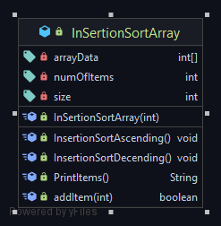

## Properties 
- arrayData[] --> this is an int of array 
- numofItems -> how many items will be allowed here will start at 0 but with increment it will go up over time 
- size --> max size of the array. 
---
## Constructor
- `InsertionSortArray(int)`
-  has only one constructor 
-  takes int as a value this will decide the array size
---
## Methods
-`InserstionSortAscending()` --> sort array based on highest to lowest. 
-`InserstionSortADecendeing()` --> sort array based on lowest to highest.
- PrintItems() --> prints all the item returns a string which will be stored 
- addItem(int) boolean -> returns true of the adding is sucessful returns false if adding falls. 

---
## Constructor Explanation 
```
  public InSertionSortArray(int size) 
  {
        this.size = size;
        this.numOfItems = 0;
        this.arrayData = new int[size];
    }
```
- `this.size = size;` gets initialized here. 
- `this.numOfItems = 0`; counter starts at 0 cause in the begining array has no items inside 
- `this.arrayData = new int[size];` size will be set of the array 

---

## Demo Constructor
`
var inserstionsorting = new InSertionSortArray(6);
`
- in here inserstionSorting  variable is created with 6 items inside 
- the array is currently empty. 
---
## Method Explanation 
### ` public boolean addItem(int item)`
```
  public boolean addItem(int item){
        if(numOfItems>size) return false;
        arrayData[numOfItems] = item;
        numOfItems++;
        return true;
    }
```
- `if(numOfItems>size) return false;`
     - this means array is full and can not enter any More Items
    - so it returns false.
-
`
arrayData[numOfItems] = item;
numOfItems++;
return true;
`
- thesse are all working together 
- `arrayData[numOfItems] = item;` add numofItems to item added to item 
- `numOfItems++;` goes up one by one 
- `return True` saying that adding was sucessful. 
---
## Demo `public boolean addItem(int item)`

```
  inserstionsorting.addItem(5);
  inserstionsorting.addItem(4);
  inserstionsorting.addItem(10);
  inserstionsorting.addItem(1);
  inserstionsorting.addItem(6);
  inserstionsorting.addItem(2);
```
-  added 6 items here. 

---


### `  public String PrintItems()`
```
  public String PrintItems(){
        StringBuilder output = new StringBuilder();
        for (int i = 0; i <numOfItems ; i++) {
            output.append(arrayData[i]).append("\n");
        }
        return output.toString();
    }

```
- simple self explanatory 
-  `numOfItems` note here `numofItems` is being used here insread of arraydata.length 
   - `numOfitems` will make sure the program does not loop through the whole thing. 
    
--- 
### InsertionSortAscending()
```
    public void InsertionSortAscending(){

        for (int i = 1; i <numOfItems-1 ; i++) {
            var value = arrayData[i];
            var hole = i;

            while (hole>0 && arrayData[hole-1]>value){
                arrayData[hole] = arrayData[hole-1];
                hole--;
            }
            arrayData[hole] =value;
        }

    }
```
- this will sort the array based on lowest to highest 
-   ` for (int i = 1; i <numOfItems ; i++) {`
      - i starts at 1 cause 
    - by default first items is always sorted 
    - so assume the index will start from 1; 
 -  `var value = arrayData[i]`;   
     - this will hold the value as the values will be shifted.
 - ` var hole = i;`
    -  hole will be modified. 
    -  it holds starting position now 
    - but throughout the code it will change as the loop progresses   
    
```
   while (hole>0 && arrayData[hole-1]>value){
                arrayData[hole] = arrayData[hole-1];
                hole--;
            }
            arrayData[hole] =value;
```
- `while (hole>0 && arrayData[hole-1]>value){`
    - in here the hole must be greater than 0 cause if the index goes at 0 means array has been sorted
- `arrayData[hole-1]>value` 
    - it will compare with startindex-1 with the value
    - if it is the value compared is the assumption 
- ` arrayData[hole] = arrayData[hole-1];` 
    - assigin hole to value by moving it to right 
    - swapping variables here 
- `hole--;` goes down one by one untill it reaches 0 which is one of the condition for proving it false. 
- ` arrayData[hole] =value;` 
    - if change has been made swapping needs to be done
     - if hole changed change to value of the targer
     - (this will be further explained on the code later. )
---    
#Demo Code 
```
item | Index
5    | 0 
4    | 1  
10   | 2 
1    | 3 
6    | 4                   
2    | 5
```
- this is the current array with starting position 
- will assume array `5` at index `0` is sorted 
- rest are not sorted 

### Phase One 

```
 for (int i = 1; i <numOfItems-1 ; i++) {
            var value = arrayData[i];
            var hole = i;

            while (hole>0 && arrayData[hole-1]>value){
                arrayData[hole] = arrayData[hole-1];
                hole--;
            }
            arrayData[hole] =value;


```
 - `value` is 4;
 - `hole` is 1;
  
-` while (hole>0 && arrayData[hole-1]>value)
   - this condition is true 
   - hole is bigger than 0
   - `arrayData[hole-1]>value`
      - `arrayData[hole-1]`
         - `hole-1` = 0
         - `arrayData[0]`-->5
   - `arrayData[hole] = arrayData[hole-1];` 
     - in here `5` is swapped value with `4`
      - `arrayData[hole] ` = 4 now 
   - `while (hole>0 && arrayData[hole-1]>value)`
     - loop is no longer true anymore 
    
*** Note if the code wants to be in deceonding sorting just switch up the condition *** 
`while (hole>0 && arrayData[hole-1]<value)`
