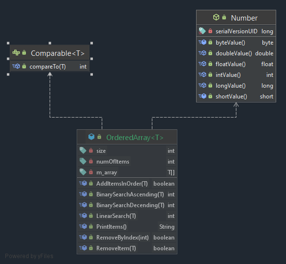

# Ordered Array

---
### addInOrder 
takes the integer to be added as a parameter and inserts it in order in the array. No duplicates are allowed.

### removeByIndex
takes the index of the item to be removed as the parameter and removes it by shifting items down from the right.

### removeItem: 
takes an item to be removed as the parameter and removes it by shifting items down from the right.

### listItems : 
prints out all items in the array

### linearSearch :
takes an item as a parameter and returns the index (position) in the array it was found, if not found return -1

### binarySearch :
takes an item as a parameter and returns the index (position) in the array it was found, if not found return -1
